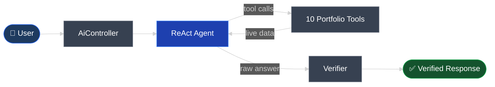
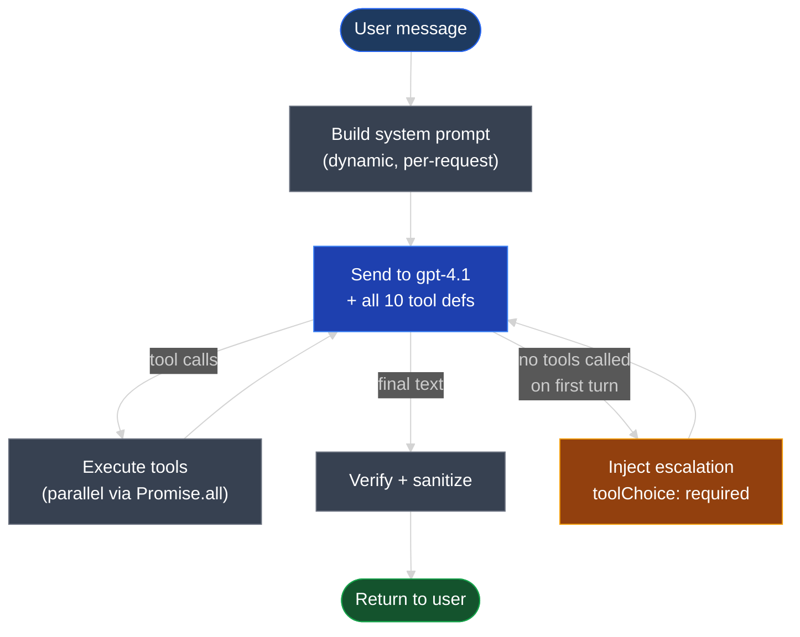

# AgentForge

**AI-powered portfolio intelligence — built on Ghostfolio**

<!-- pause -->

Take an open-source wealth management platform.

Add a ReAct agent that can _actually read your portfolio_.

<!-- pause -->

10 tools. No hallucination. Every answer grounded in live data.

---

# The Problem

Ghostfolio gives you **great data** — but you have to know where to look.

<!-- pause -->

Want to know your risk concentration? Navigate to X-Ray → Allocations → mentally calculate.

Want to simulate selling AAPL? There's no way to do that.

Want a tax-loss harvesting estimate? Export to a spreadsheet.

<!-- pause -->

**The data is there. The interface to ask questions about it is not.**

---

# The Fork Boundary

One rule: **don't touch upstream code.**

<!-- pause -->

```
apps/api/src/app/endpoints/ai/    ← everything new lives here
├── agent/                         # ReAct loop + system prompt
├── tools/                         # 10 portfolio tools
├── verification/                  # Confidence scoring
├── routing/                       # Tool selection (pass-through)
├── llm/                           # OpenAI client
├── observability/                 # Langfuse tracing
├── utils/                         # Sanitizer, validators
└── contracts/                     # Error codes, response schema
```

<!-- pause -->

48 production files. 33 test files. Zero changes to Ghostfolio.

The AI module calls `PortfolioService`, `OrderService`, `ExchangeRateDataService` — services that already exist.

---

# How It Works



<!-- pause -->

No LangChain. No AutoGen. ~200 lines of explicit control flow.

---

# The ReAct Loop



<!-- pause -->

Guardrails fire if: **15 iterations** · **$0.25 cost** · **60s timeout** · **3 tool failures**

---

# The 10 Tools

| Tool                      | What it does                              |
| ------------------------- | ----------------------------------------- |
| `get_portfolio_summary`   | Value, allocation, top holdings           |
| `get_transaction_history` | Filtered transactions with pagination     |
| `analyze_risk`            | Sharpe, Sortino, VaR, CVaR, drawdown      |
| `market_data_lookup`      | Quote + price history for any symbol      |
| `performance_compare`     | Portfolio vs benchmarks over time         |
| `compliance_check`        | Rule-based policy gate                    |
| `rebalance_suggest`       | Target allocations with trade flags       |
| `simulate_trades`         | What-if: hypothetical trades applied      |
| `stress_test`             | Market shocks → per-position impact       |
| `tax_estimate`            | Short/long-term gains, harvest candidates |

<!-- pause -->

Every tool has strict JSON schemas. Every field has a `description`.

The LLM picks which tools to call — no keyword router.

---

# Verification — No Second LLM Call

Deterministic heuristic scoring:

<!-- pause -->

**HIGH** — completed + called tools + no errors

**MEDIUM** — partial completion, tool errors, or no tools used

**LOW** — failed (guardrail fire, timeout, empty response)

<!-- pause -->

Additional checks:

- **Unbacked claim detection** — regex flags dollar amounts / percentages without a supporting tool call
- **Output sanitizer** — strips HTML, kills `` exfil links
- **Structured error codes** — `TIMEOUT`, `COST_LIMIT`, `CIRCUIT_BREAKER`, etc.
- **`requiresHumanReview`** — set when confidence is LOW or a guardrail fired

<!-- pause -->

> Why no LLM-as-judge? Doubles cost. Doubles latency. The heuristic catches the failure modes that matter.

---

# Eval Results

```
Test Suites:  52 passed
Tests:        309 passed
Time:         ~19 s
```

<!-- pause -->

| Tier             | Cases | LLM          | Pass Rate |
| ---------------- | ----- | ------------ | --------- |
| Fast (CI)        | 27    | Mocked       | **27/27** |
| Live (pre-merge) | 12    | gpt-4.1-mini | **12/12** |
| MVP              | 5     | Real LLM     | **5/5**   |
| Nightly          | 31    | Real LLM     | **31/31** |

<!-- pause -->

Fast tier uses scripted LLM responses + deterministic tool stubs.

Schemas imported from production — **fixture drift is structurally impossible**.

---

# Observability

**Langfuse** traces every agent request:

- Tool names, iteration count, token usage
- Confidence, warnings, `requiresHumanReview`
- User feedback (👍/👎) attached to traces

<!-- pause -->

**Structured telemetry** — JSON log per agent run:

```json
{
  "status": "completed",
  "toolCalls": 2,
  "iterations": 3,
  "estimatedCostUsd": 0.012,
  "elapsedMs": 4299
}
```

<!-- pause -->

**No PII in logs.** `userId` intentionally omitted. `requestId` for trace correlation.

---

# What I'd Do Next

<!-- pause -->

- **Semantic tool routing** via embeddings (if token cost becomes a concern at scale)

- **Monte Carlo simulation** tool (most-requested missing capability)

- **Multi-model fallback** — try gpt-4.1-mini first, escalate to gpt-4.1 on low confidence

- **Redis-backed rate limiter** for multi-instance deployments (current one is in-memory)

<!-- pause -->

The architecture supports all of these without touching upstream Ghostfolio.

---

# Demo

```bash
# Start the stack
./dev.sh up && ./dev.sh seed && ./dev.sh token

# Try it
curl -X POST http://localhost:3333/api/v1/ai/chat \
  -H "Authorization: Bearer $TOKEN" \
  -H "Content-Type: application/json" \
  -d '{"message": "What does my portfolio look like?"}'
```

<!-- pause -->

Or open `http://localhost:4200` and press **⌘K**.
